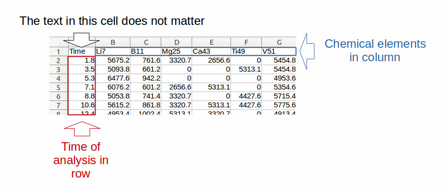
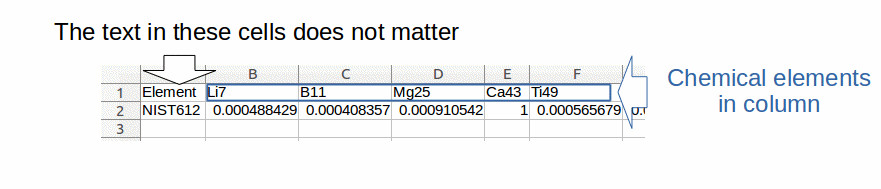
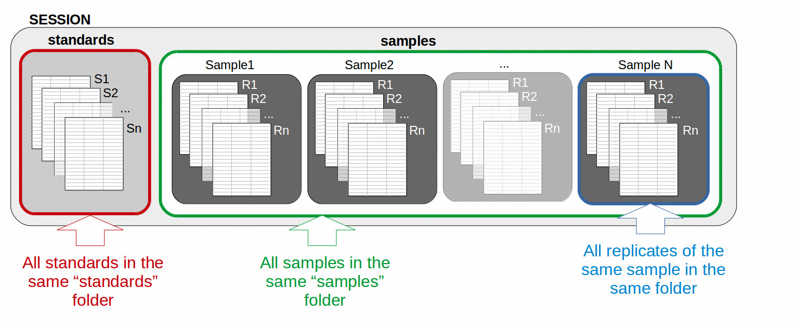

```{r out.width = '30%', echo= FALSE, fig.align="center"}

```

# Procedures of elementR

<br />

The data reduction proceeded by the elementR package is organized in a session framework including five main steps (indicate on the left side bar of the opened page of the web browser):


The data reduction proceeded by the elementR package is organized in a session framework including five main steps (indicate on the left side bar of the opened page of the web browser):  

- Step 1. The setting of the main parameters of the procedure
- Step 2. The filtration of the standards
- Step 3. The machine drift verification & correction
- Step 4. The filtration of the samples
- Step 5. The sample replicate averaging

For more details on the procedure, see the [documentation](elementR_documentation.pdf).

Note that these steps have to be carried out in the order mentioned above, the third step, for instance, being not available until the first and second one are validated.

The left side bar allows to navigate between these steps and to know exactly which part of the procedure is currently running, validates or remains to complete. 

The two last tabs “Configuration”and “Source code for app” are not part of the data reduction procedure but bring additional information detailed later in this document.

<br />

# Data requirements

<br />

- A set of data from standard analysis (at least one). elementR is compatible with all standard types (NIST 612,  NIST 610, MACS...). However, standards of a single session must have all the same type (that is the reason we call them standard replicates and that they are stored in a same folder).

- A calibration file providing for each investigated chemical element:
$$Calib_X = \frac{[X]_{calibType}}{[InternStandard]_{calibType}}$$
where:<br />
$Calib_X$ is the value to include in the calibration file for the chemical element X <br />
$[X]_{calibType}$ is the concentration of the chemical element X contained in the calibration material <br />
$[InternStandard]_{calibType}$ is the concentration of the internal standard element contained in the calibration material<br />

- A set of data from sample analysis (at least one, obviously :D). Sample may have one or more replicates, these replicates being averaged in the last step. 

<br />


# Format requirements

<br />

- The format of data compatible with the elementR application are those from worksheet from Excel (.xls, .xlsx), LibreOffice (.ods) or text (.csv). <br />
For the text format, the separator used by default is the semi-colon. However, you can change this parameter before uploading your project in the configuration tab. <br />
For any format (except for text format), the decimal has to be indicated by a point (for text format, you can however customize the decimal in the configuration tab  before uploading your project). <br />
For Excel format, elementR reads the first worksheet of the file. For OpenOffice format, you have to indicate to elementR the sheet to import by calling the sheet to import "data". <br />

- **Sample and standard** data must be all organized in the same way (fig.1):  
In column 1, the time of successive analysis. <br />
In the following columns, the chemical elements with element names as column heads. <br />
All data must contain the same chemical elements in the same order. <br />
Data must contain only numerical characters (except for the names of the columns). <br />
When you upload your data, elementR checks the validity of these points and indicates the problem if any.

```{r , echo=FALSE, fig.cap="Figure 1: example of data format compatible with elementR application for sample and standard replicate data:  chemical elements in column (in blue) with their name at the top of each column, time of analysis in row (in red). The text included in the cell at the top of the analysis time does not matter.  \\label{figureFormat}", out.width = '70%'}

```

- The file comprising the **calibrations** data must have its own organization (fig. 2): 
In columns, the chemical elements with their name at the head of each column.<br />
The text in the cells of the first column does not matter.<br />
The data of the calibration file must contain the same chemical elements in the same order than in the standard and sample files.<br />
The data of the calibration file must be normalized (i.e. divided) by the concentration of the internal standard.<br />
Data must contain only numerical characters (except for the first column and the names of the chemical elements).<br />

```{r , echo=FALSE, fig.cap="Figure 2: example of data structure compatible with elementR application for calibration data: chemical elements in column (in blue) with their name at the top of each column. The text included in the cells of the first column does not matter.  \\label{figureFormat2}", out.width = '70%'}

```

Some compatible format of all kind of data are provided with the elementR package, take a look ! (in the folder where R packages are installed, reach the elementR folder and look at the “Example_Session”, you will find the files).

<br />

# Data structure

<br />

The data must be organized in a session framework (Fig. 3):

All file corresponding to standard replicates must be included in the same folder called “standards” (= batch of standard replicates).<br />
All samples must be included in the same folder called “samples”.<br />
All sample replicates of the same sample (even if there is only a single replicate) must be included in a folder with the name of the considered sample (= a batch of sample replicates).<br />
The “standards” and the “samples” sub-folders have to be included in a folder called with the name of the project.<br />
In any case when you upload your data, elementR checks the validity of these points and indicates the problem if any.<br />

A compatible format of session is provided with the elementR package, have a look ! (in the folder where R packages are installed, reach the elementR folder1 and look at the “Example_Session” organization).

```{r , echo=FALSE, fig.cap="Figure 3: example of session organization compatible with elementR application: all standards (S1, S2, Sn) are in a “standards” folder (in red), all samples are in a “samples” folder (in green). Each sample replicate R1, R2, Rn (even if there is only a single replicate) must be included in a sub-folder with the name of the sample (in blue). The name of the sample sub-folders and of the standard and sample replicates do not matter.   \\label{figureFormat3}", out.width = '70%'}

```

<br />

# Installation

<br />

### Before installation

1. Check the version of R installed on your computer (`sessionInfo()`), must be ≥ 3.2.3, see [https://cran.r-project.org/](https://cran.r-project.org/) to update your version.

2. __For Mac users only__: elementR package needs XQuartz. Please check, that XQuartz is installed and runs properly on your computer. If not, please visit [https://www.xquartz.org/](https://www.xquartz.org/).


<br />

### Installation
The easiest way to get elementR is to install it from [CRAN](https://CRAN.R-project.org/package=elementR):

```
install.packages("elementR", dependencies = T)
library(elementR)
```

Alternatively, you can install the development version (not yet pushed on cran) from [GitHub](https://github.com/charlottesirot/elementR) :

```
#Install elementR's dependencies
pkgs <- c("gdata", "shiny","devtools", "shinyjs", "gnumeric", "R6", "shinydashboard",
	"abind", "stringr", "lmtest", "tcltk", "tcltk2", "reader", "readODS", "readxl", "outliers", "climtrends",
	"EnvStats", "colourpicker", "zoo", "httpuv")

invisible(lapply(pkgs, function(pkgs){
	if(!require(pkgs)){
		install.packages(pkgs, dependencies=TRUE)
	}
}))

#Install elementR
devtools::install_github("charlottesirot/elementR", ref = "master", force = T, dependencies = T)

library(elementR)
```
<br />

### Notes on installation :

For Mac users: during installation elementR will ask to install "XCode/otool". Accept this installation.

If the installation is stuck at the installation of the tcltk package, this probably means that XQuartz does not run properly. Check its validity.

For Linux users: you could need to install additional libraries: 

```
sudo apt-get update
sudo apt-get install libcurl4-openssl-dev
sudo apt-get install libssl-dev
sudo apt-get install libxml2-dev
sudo apt-get install libssh2-1-dev
```

the elementR GUI runs on any web browser. However, as the graphic of the user interface has been developed based on Firefox, authors highly recommend to run elementR under [Firefox](https://www.mozilla.org/en-US/firefox/new/).

<br />

### Usage

To launch elementR, run the following command in your R console:

```
runElementR()
```

<br />

# And if there is a bug?

<br />

If, despite the `` `r emo::ji("heart")` `` brought during the programming of this R package and writing of this documentation, you have difficulties to install or run elementR, if you have questions about the procedures or calculations, or if you want to report bugs :beetle:, do not hesitate to consult the official elementR documentation above or on [CRAN](https://CRAN.R-project.org/package=elementR) or connect with us on [GitHub](https://github.com/charlottesirot/elementR).
